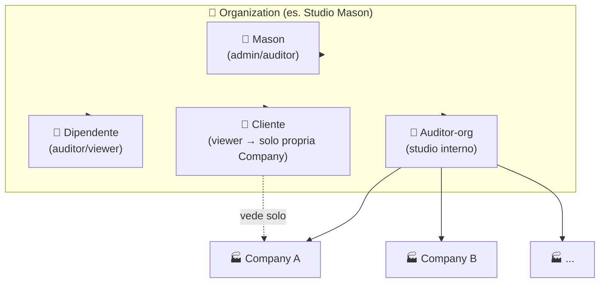
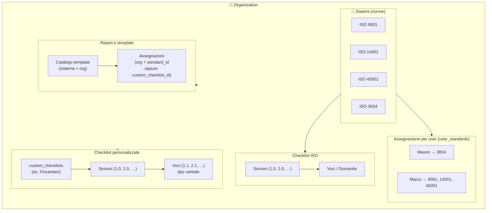
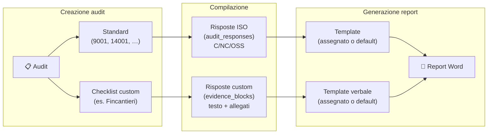
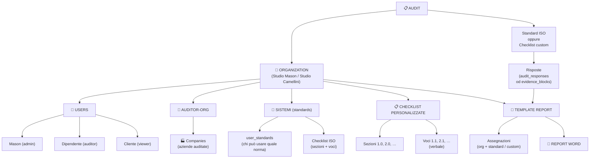

# Schema completo: utenti, organization, checklist, sistemi e report

Documento che integra **chi** (organization / user / ruolo), **checklist** (ISO e personalizzate), **sistemi/norme** e **report/template**, incluso il caso dipendente e cliente.

> **Implementazione RBAC e scope API** (regole vincolanti, migrazione, sicurezza): vedere [ARCHITETTURA_UTENTI_RBAC.md](ARCHITETTURA_UTENTI_RBAC.md). Questo file resta orientato a **modello dati e diagrammi di prodotto**; dove divergono, prevale l’architettura RBAC fino ad allineamento del codice.

---

## Rappresentazione grafica gerarchica

I diagrammi sotto sono in **Mermaid**: si vedono come grafici su GitHub, in VS Code (con estensione Markdown Preview Mermaid) e in molti viewer Markdown. Se non si renderizzano, copia il blocco in [mermaid.live](https://mermaid.live) per visualizzarli.

### 1. Gerarchia: Organization → Utenti e risorse



### 2. Gerarchia: Sistemi, checklist e template report



### 3. Flusso: Audit → Checklist → Report



### 4. Vista complessiva (una sola gerarchia)



---

## 1. Chi è chi: Organization e User

| Livello | Cosa rappresenta | Esempio | Nel DB |
|--------|-------------------|--------|--------|
| **Organization** | Il tenant (studio/azienda che usa il sistema) | Studio Mason, Studio Camellini, QS Studio | `organizations.organization_id` |
| **User** | La persona che fa login | Mason, Camellini, dipendente di Mason, cliente che vede i propri audit | `users.user_id`, `users.organization_id` |
| **Auditor-org** | Studio/team interno all’organization (opzionale) | “Studio Mason – sede A” | `auditor_orgs.id`; `users.auditor_org_id` |
| **Company** | Azienda auditata (cliente dello studio) | Azienda X auditata da Mason | `companies.id`, `companies.auditor_org_id` |

Relazioni:
- **1 organization** → molti **users** (Mason, dipendente, eventuale cliente).
- **1 user** → 1 **organization**; opzionale 1 **auditor_org** (se è uno “studio” interno).
- **1 auditor_org** → molte **companies** (le aziende che quello studio audita).

---

## 2. Ruoli e figure tipiche

| Figura | Organization | User | Ruolo tipico | Cosa fa |
|--------|---------------|------|--------------|---------|
| **Mason** | Studio Mason | Sì (Mason) | admin o auditor | Crea audit, checklist custom, genera report; gestisce utenti e standard. |
| **Dipendente di Mason** | Studio Mason | Sì (secondo user) | auditor o viewer | Come Mason (in base al role): crea/compila audit, genera report; stessi dati dell’org. |
| **Cliente (azienda auditata)** | Studio Mason* | Sì (user “cliente”) | viewer (o ruolo “cliente”) | Accede **solo** ai dati della **propria** company: audit e self-assessment che la riguardano; nessuna creazione audit/checklist. |

\* Il cliente può essere user della **stessa** organization (Studio Mason) con accesso filtrato per `company_id`, oppure (modello alternativo) organization separata “Azienda X” con i propri user.

---

## 3. Sistemi (norme / standard)

- **Sistemi** = norme ISO (9001, 14001, 45001, 3834, ecc.) registrate in **`standards`** (`standard_id`, `standard_code`, …).
- **Chi può usarli**:
  - **Per organization**: abbonamento/attivazione (es. `subscriptions`: auditor_org ↔ standard_id). L’organization (lo studio) ha attivi certi standard.
  - **Per user**: restrizione opzionale **`user_standards`** (user_id, standard_id). Se **nessuna riga** → l’utente può usare tutti gli standard attivi per l’org; se **ci sono righe** → può solo quelli assegnati (es. Marco: 9001, 14001, 45001; Mason: 3834).
- **Dove si usa**: in creazione audit (quali standard associare all’audit) e in creazione/compilazione checklist (quale “sistema” usa la checklist).

Riepilogo:
- **Checklist ISO** = legate a un **standard_id** (sezioni/voci da `checklist_sections` / `checklist_questions`).
- **Checklist personalizzate** = **non** legate a una norma; create dall’org in `custom_checklists` (es. Fincantieri).

---

## 4. Checklist: ISO vs personalizzate

| Tipo | Dove è definita | Chi la crea/modifica | Chi la usa in audit | Risposta |
|------|-----------------|----------------------|----------------------|----------|
| **Checklist ISO** | DB: `standards` + `checklist_sections` + `checklist_questions` (master globali) | Solo admin/sistema (norma fissa); eventuale “stralcio” norm_excerpt da admin | User con quello standard assegnato (user_standards) | C/NC/OSS/OM/NA; salvataggio in `audit_responses` |
| **Checklist personalizzata** | DB: `custom_checklists` + `custom_checklist_sections` + `custom_checklist_items` (per organization_id) | Admin/auditor dell’org: crea sezioni e voci (es. 1.0, 1.1, 2.0, 2.1 …) | User dell’org quando crea un audit con “checklist custom” selezionata | Tipo “verbale”: blocchi evidenza (testo + allegato) in `audit_custom_checklist_responses.evidence_blocks` |

Collegamento all’audit:
- **Audit “solo ISO”**: `audit_standards` (audit_id, standard_id); le risposte sono in `audit_responses` (question_id da checklist_questions).
- **Audit “con checklist custom”**: `audits.custom_checklist_id`; le risposte sono in `audit_custom_checklist_responses` (custom_item_id + evidence_blocks).
- Un audit può avere **solo standard**, **solo checklist custom**, o **entrambi** (standard + custom).

---

## 5. Report e template

- **Report** = documento generato (Word/PDF): report audit (ISO o verbale) o report self-assessment (SAL).
- **Template** = file .docx (o riferimento) usato per generare il report. Registrati in **`report_templates`** (catalogo: template di sistema + template per organization_id).
- **Assegnazione** = “per questo contesto uso questo template”:
  - **report_template_assignments**: (organization_id, standard_id **oppure** custom_checklist_id) → report_template_id.
  - Se **nessuna assegnazione** per (org, standard) → si usa il **template di sistema** per quello standard (es. ISO9001-audit-report.docx).
  - Se **assegnazione presente** → l’org usa il **proprio** template (es. “Studio Mason – report 9001 personalizzato”).
  - Per **checklist custom**: stesso meccanismo (default = template “Verbale visita” di sistema; override = template custom dell’org, anche a pagamento).

Chi genera / chi vede:
- **Genera report**: user che ha accesso all’audit (auditor/admin dell’org, o dipendente); in futuro il “cliente” potrebbe generare solo report in sola lettura dei propri audit.
- **Quale template**: deciso per **organization**: tutti gli user dell’org usano lo stesso set di template (quelli assegnati all’org per quel standard o per quella checklist custom). Un “template per utente” si può aggiungere in seguito con un livello in più (es. report_template_assignments con user_id opzionale).

Riepilogo logica report:
- **Sistema (standard_id)** → risoluzione: assignment(org, standard_id) oppure template di sistema per quello standard → file .docx → generazione report audit.
- **Checklist custom (custom_checklist_id)** → risoluzione: assignment(org, custom_checklist_id) oppure custom_checklist.default_report_template_id oppure template “Verbale visita” di sistema → file .docx → generazione report audit.
- **Self-assessment** (futuro): template tipo SAL assegnato per scope “self_assessment” (per org o per company).

---

## 6. Self-assessment (contesto separato)

- **Self-assessment** = autovalutazione dell’**azienda** (company) rispetto a requisiti (es. 14001, 9001, 45001): stato “discusso / in corso / da validare / completato” + note + doc.
- **Chi lo compila**: in genere l’azienda (company) o un user “cliente” che rappresenta l’azienda; oppure l’auditor per conto dell’azienda.
- **Dove si salva**: `self_assessments` (company_id, nome, scope, …) + `self_assessment_responses` (per requisito: status, notes, doc_reference).
- **Report**: export tipo SAL (tabella requisiti + colonne implementazione); template report assegnabile per scope “self_assessment”.
- **Chi vede**: user dell’org (auditor/admin) che ha in carico quella company; eventuale user “cliente” solo per la propria company.

---

## 7. Schema riassuntivo per figura

| Figura | Organization | Audit | Checklist (ISO) | Checklist (custom) | Sistemi (standard) | Report / template |
|--------|--------------|-------|------------------|--------------------|--------------------|-------------------|
| **Mason** | Studio Mason | Crea/vede audit dello studio (filtrati per auditor_org se valorizzato) | Usa solo standard a lui assegnati (user_standards) | Crea/modifica checklist custom dell’org; usa in audit | Vede/sceglie solo standard assegnati | Genera report; usa template assegnati all’**org** (ISO e custom) |
| **Dipendente Mason** | Studio Mason | Come Mason (stessa org, stessi filtri) | Come Mason (o subset se user_standards diverso) | Usa checklist custom dell’org (non le crea se non admin) | Come Mason (o subset) | Come Mason: template dell’org |
| **Cliente** | Studio Mason (o org “Azienda X”) | **Solo lettura** audit della **propria** company | Solo lettura (vede checklist compilate negli audit che vede) | Solo lettura se audit ha custom | Non gestisce standard | Può solo **vedere/scaricare** report degli audit della propria company (se previsto dal ruolo) |

---

## 8. Flusso dati in sintesi

```
Organization (Studio Mason)
├── Users: Mason (admin), Dipendente (auditor), Cliente (viewer legato a company_id)
├── Auditor-org(s) → Companies (aziende auditate)
├── Standards attivi (subscriptions) + user_standards (Mason: 3834; altro user: 9001, 14001)
├── Custom checklists (create dall’org, es. Fincantieri)
├── Report templates (catalogo: sistema + org) + assignments (org, standard_id | custom_checklist_id → template_id)
│
├── Audit
│   ├── standard_id(s) → checklist ISO → audit_responses
│   ├── custom_checklist_id → audit_custom_checklist_responses (evidence_blocks)
│   └── Report: risoluzione template(org, standard | custom_checklist) → generazione Word
│
└── Self-assessment (futuro)
    ├── company_id → self_assessments → self_assessment_responses
    └── Report: template SAL
```

---

*Riferimenti: VERIFICA_ISOLAMENTO_DATI.md, DATABASE_SCHEMA.md, ROADMAP_TEMPLATE_E_CHECKLIST_PERSONALIZZATE.md, ASSEGNAZIONE_STANDARD_UTENTI.md.*
