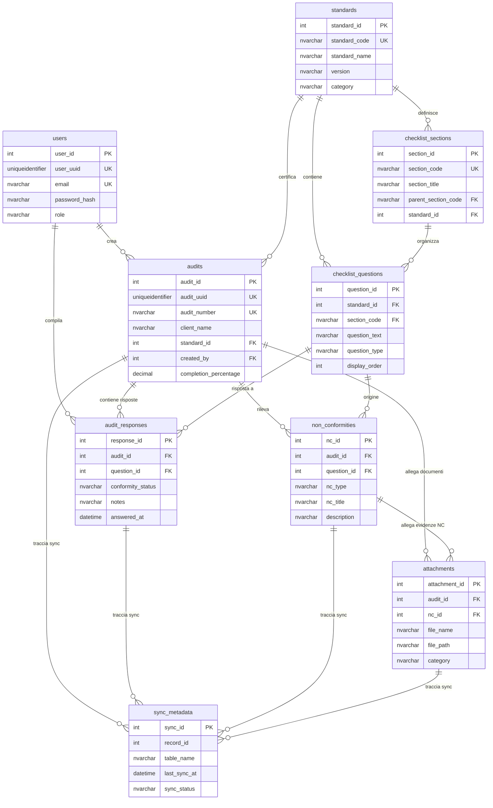

# ADR-003: Analisi Architettura Database e Processi Applicativi

---

**Stato**: ✅ **Approvato - In Implementazione**  
**Data Creazione**: 2026-01-10  
**Data Approvazione**: 2026-01-10  
**Autore**: System Architect  
**Approvatore**: QS Studio  
**Sessione**: Audit architettura database e processi  
**Tag**: database-design, process-mapping, scalability, data-model, multi-standard, gdpr

---

## 1. Opzioni Risposta Checklist (Conformity Status)

### 1.1 Le 6 Opzioni Ufficiali

| Codice  | Descrizione                             | Significato Audit                                          | Peso Calcolo Conformità |
| ------- | --------------------------------------- | ---------------------------------------------------------- | ----------------------- |
| **CO**  | Soddisfatto (Conforme)                  | Requisito pienamente soddisfatto                           | +1 (100%)               |
| **OSS** | Parzialmente soddisfatto (Osservazione) | Requisito soddisfatto con margini miglioramento            | +0.5 (50%)              |
| **NC**  | Non Soddisfatto (Non Conformità)        | Requisito NON soddisfatto - azione correttiva obbligatoria | 0 (0%)                  |
| **OM**  | Opportunità di Miglioramento            | Requisito soddisfatto ma con potenziale ottimizzazione     | +0.75 (75%)             |
| **NA**  | Non Applicabile                         | Requisito escluso dal campo applicazione SGQ               | - (escluso da calcolo)  |
| **NV**  | Non Verificato                          | Requisito non ancora valutato (audit in corso)             | - (escluso da calcolo)  |

### 1.2 Implementazione Database Attuale

**Campo**: `audit_responses.conformity_status`

```sql
-- Definizione attuale
conformity_status NVARCHAR(20) NULL
CHECK (conformity_status IN ('C', 'NC', 'OM', 'NA', NULL))
```

#### 🔴 PROBLEMA CRITICO: Mancano 2 opzioni

| Codice Mancante | Impatto                                                                           | Priorità Fix |
| --------------- | --------------------------------------------------------------------------------- | ------------ |
| **OSS**         | ❌ Impossibile registrare osservazioni<br>(perdita dati audit parziali)           | 🔴 ALTA      |
| **NV**          | ❌ Impossibile tracciare domande non verificate<br>(completion_percentage errato) | 🟡 MEDIA     |

**Codice 'C' vs 'CO'**: Discrepanza naming (backend usa 'C', checklist ufficiale usa 'CO')

### 1.3 Migration Proposta

```sql
-- Migration 006: Fix conformity_status options
ALTER TABLE audit_responses DROP CONSTRAINT CK_audit_responses_conformity;

ALTER TABLE audit_responses
ADD CONSTRAINT CK_audit_responses_conformity
CHECK (conformity_status IN ('CO', 'OSS', 'NC', 'OM', 'NA', 'NV', NULL));

-- Migrazione dati esistenti
UPDATE audit_responses SET conformity_status = 'CO' WHERE conformity_status = 'C';
```

### 1.4 Tabella Lookup Proposta (Best Practice)

**RACCOMANDAZIONE**: Creare tabella master `conformity_statuses`

```sql
CREATE TABLE conformity_statuses (
    status_code NVARCHAR(5) PRIMARY KEY,
    status_name NVARCHAR(100) NOT NULL,
    description NVARCHAR(500),
    weight_percentage DECIMAL(5,2), -- Per calcolo conformità
    exclude_from_calc BIT DEFAULT 0, -- NA e NV esclusi
    display_order INT,
    is_active BIT DEFAULT 1
);

INSERT INTO conformity_statuses VALUES
('CO',  'Conforme (Soddisfatto)',              'Requisito pienamente soddisfatto', 100.00, 0, 1, 1),
('OSS', 'Osservazione (Parzialmente Sodd.)',   'Requisito con margini miglioramento', 50.00, 0, 2, 1),
('NC',  'Non Conforme (Non Soddisfatto)',      'Requisito NON soddisfatto - azione correttiva richiesta', 0.00, 0, 3, 1),
('OM',  'Opportunità Miglioramento',           'Requisito soddisfatto con potenziale ottimizzazione', 75.00, 0, 4, 1),
('NA',  'Non Applicabile',                     'Requisito escluso dal campo applicazione SGQ', NULL, 1, 5, 1),
('NV',  'Non Verificato',                      'Requisito non ancora valutato', NULL, 1, 6, 1);
```

**Vantaggi**:

- ✅ Facile aggiunta nuovi stati (es: 'NP' = Non Pertinente)
- ✅ Calcolo conformità dinamico (via `weight_percentage`)
- ✅ UI dinamica (dropdown popolato da DB)
- ✅ Multilingua (aggiungere campo `status_name_en`)

---

## 2. Mappa Relazioni Database (ERD Semantico)

### 2.1 Relazioni Tabelle ESISTENTI (Verificate)



### 2.2 Chiavi e Vincoli Integrità

| Tabella                 | PK              | FK (Vincoli Integrità Referenziale)                                                                    | UK (Unique Constraints)                      |
| ----------------------- | --------------- | ------------------------------------------------------------------------------------------------------ | -------------------------------------------- |
| **standards**           | `standard_id`   | -                                                                                                      | `standard_code`                              |
| **checklist_sections**  | `section_id`    | `standard_id` → standards<br>`parent_section_code` → checklist_sections                                | `section_code`                               |
| **checklist_questions** | `question_id`   | `standard_id` → standards<br>`section_code` → checklist_sections                                       | `question_uuid`                              |
| **users**               | `user_id`       | -                                                                                                      | `user_uuid`<br>`email`                       |
| **audits**              | `audit_id`      | `standard_id` → standards<br>`created_by` → users                                                      | `audit_uuid`<br>`audit_number`               |
| **audit_responses**     | `response_id`   | `audit_id` → audits (CASCADE)<br>`question_id` → checklist_questions (CASCADE)<br>`created_by` → users | `response_uuid`<br>`(audit_id, question_id)` |
| **non_conformities**    | `nc_id`         | `audit_id` → audits (CASCADE)<br>`question_id` → checklist_questions (CASCADE)                         | `nc_uuid`                                    |
| **attachments**         | `attachment_id` | `audit_id` → audits (CASCADE)<br>`nc_id` → non_conformities (CASCADE)                                  | `attachment_uuid`                            |
| **sync_metadata**       | `sync_id`       | -                                                                                                      | `(table_name, record_id)`                    |

**Legenda**:

- CASCADE = Se elimini audit, elimini automaticamente risposte/NC/allegati
- NO ACTION = Non puoi eliminare standard se ci sono audit collegati

---

## 3. Mapping Processi → Tabelle (Process-Driven Design)

### 3.1 PROCESSO: Gestione Utenti & Autenticazione

**Obiettivo**: Registrazione, login, gestione ruoli, sicurezza

| Sottoprocesso            | Tabelle Coinvolte | Campi Critici                                                          | Frontend UI                             | Backend API                           |
| ------------------------ | ----------------- | ---------------------------------------------------------------------- | --------------------------------------- | ------------------------------------- |
| **Registrazione Utente** | `users`           | `email`<br>`password_hash`<br>`full_name`<br>`role` (default: auditor) | `app/src/pages/RegisterPage.jsx`        | `POST /api/auth/register`             |
| **Login**                | `users`           | `email`<br>`password_hash`<br>`last_login`                             | `app/src/pages/LoginPage.jsx`           | `POST /api/auth/login`<br>(JWT token) |
| **Gestione Ruoli**       | `users`           | `role` (admin/auditor/viewer)                                          | `app/src/pages/UsersManagementPage.jsx` | `PATCH /api/users/:id/role`           |
| **Password Reset**       | `users`           | `password_hash`<br>`updated_at`                                        | `app/src/pages/ResetPasswordPage.jsx`   | `POST /api/auth/reset-password`       |

**Tabelle Mancanti** ⚠️:

- ❌ `password_reset_tokens` (per email recovery con token temporaneo)
- ❌ `user_sessions` (per gestire logout da tutti i dispositivi)
- ❌ `audit_log_users` (tracciare modifiche ruoli - conformità ISO 9001:2015 punto 7.5.3.2)

**Raccomandazione**: Aggiungere tabelle security in **Migration 007** (Fase 2).

---

### 3.2 PROCESSO: Creazione e Gestione Audit

**Obiettivo**: Pianificare, eseguire, completare audit ISO 9001/14001/45001

| Sottoprocesso             | Tabelle Coinvolte                                                    | Campi Critici                                                                               | Frontend UI                                                           | Backend API                                              |
| ------------------------- | -------------------------------------------------------------------- | ------------------------------------------------------------------------------------------- | --------------------------------------------------------------------- | -------------------------------------------------------- |
| **Crea Nuovo Audit**      | `audits`<br>`standards`                                              | `audit_number` (auto-gen)<br>`client_name`<br>`standard_id`<br>`audit_date`<br>`created_by` | `app/src/pages/CreateAuditPage.jsx`                                   | `POST /api/audits`                                       |
| **Carica Checklist**      | `checklist_questions`<br>`standards`                                 | `standard_id`<br>`question_text`<br>`section_code`                                          | `app/src/contexts/StorageContext.jsx`<br>(initializeISO9001Checklist) | `GET /api/standards/:id/questions`<br>(⚠️ **DA CREARE**) |
| **Compila Risposte**      | `audit_responses`<br>`checklist_questions`                           | `question_id`<br>`conformity_status`<br>`notes`<br>`is_answered`                            | `app/src/pages/AuditChecklistPage.jsx`                                | `POST /api/audits/:id/responses`                         |
| **Salva Risposte (Bulk)** | `audit_responses`                                                    | `audit_id`<br>`responses[]` (array)                                                         | `app/src/contexts/StorageContext.jsx`<br>(updateCurrentAudit)         | `POST /api/audits/:id/responses/bulk`                    |
| **Calcola Completamento** | `audits`<br>`audit_responses`                                        | `answered_questions`<br>`total_questions`<br>`completion_percentage`                        | Auto-calcolato frontend                                               | Trigger DB `trg_audit_completion`                        |
| **Esporta Report**        | `audits`<br>`audit_responses`<br>`non_conformities`<br>`attachments` | Tutti i dati audit                                                                          | `app/src/pages/AuditReportPage.jsx`                                   | `GET /api/audits/:id/report`<br>(PDF/DOCX)               |

**Tabelle Mancanti** ⚠️:

- ❌ `audit_templates` (template checklist pre-configurate per settore - es: automotive, alimentare)
- ❌ `audit_schedule` (calendario audit programmati con reminder)
- ❌ `audit_team` (multi-auditor su stesso audit - es: lead auditor + technical expert)

---

### 3.3 PROCESSO: Gestione Non Conformità (NC)

**Obiettivo**: Rilevare, tracciare, risolvere NC con azioni correttive

| Sottoprocesso                 | Tabelle Coinvolte                         | Campi Critici                                                                     | Frontend UI                                                      | Backend API                                  |
| ----------------------------- | ----------------------------------------- | --------------------------------------------------------------------------------- | ---------------------------------------------------------------- | -------------------------------------------- |
| **Rileva NC**                 | `non_conformities`<br>`audit_responses`   | `nc_type` (minore/maggiore)<br>`nc_title`<br>`description`<br>`question_id`       | `app/src/pages/AuditChecklistPage.jsx`<br>(bottone "Segnala NC") | `POST /api/audits/:id/non-conformities`      |
| **Allega Evidenze NC**        | `attachments`<br>`non_conformities`       | `nc_id`<br>`file_name`<br>`file_path`<br>`category`                               | `app/src/components/AttachmentUpload.jsx`                        | `POST /api/non-conformities/:id/attachments` |
| **Assegna Azione Correttiva** | `corrective_actions`<br>(⚠️ **MANCANTE**) | `nc_id`<br>`action_description`<br>`responsible_person`<br>`deadline`<br>`status` | ❌ **DA CREARE**                                                 | ❌ **DA CREARE**                             |
| **Chiudi NC**                 | `non_conformities`                        | `resolution_date`<br>`resolution_notes`<br>`status` (aperta/chiusa)               | ❌ **DA CREARE**                                                 | `PATCH /api/non-conformities/:id/close`      |

**Tabelle Mancanti** 🔴 **CRITICHE**:

```sql
-- Tabella corrective_actions (ISO 9001:2015 punto 10.2)
CREATE TABLE corrective_actions (
    action_id INT IDENTITY(1,1) PRIMARY KEY,
    nc_id INT NOT NULL FOREIGN KEY REFERENCES non_conformities(nc_id) ON DELETE CASCADE,
    action_description NVARCHAR(MAX) NOT NULL,
    responsible_person NVARCHAR(255),
    deadline DATE,
    status NVARCHAR(20) CHECK (status IN ('planned', 'in_progress', 'completed', 'verified')),
    completion_date DATETIME2,
    effectiveness_verified BIT DEFAULT 0,
    created_at DATETIME2 DEFAULT GETDATE(),
    updated_at DATETIME2 DEFAULT GETDATE()
);
```

**Impatto Mancanza**:

- ❌ Non conformità ISO 9001:2015 punto **10.2** (Azioni correttive)
- ❌ Impossibile tracciare efficacia azioni correttive
- ❌ Perdita evidenze per certificazione (gap critico audit di terza parte)

---

### 3.4 PROCESSO: Gestione Allegati & Evidenze

**Obiettivo**: Caricare, archiviare, recuperare documenti/foto audit

| Sottoprocesso       | Tabelle Coinvolte | Campi Critici                                                          | Frontend UI                         | Backend API                                             |
| ------------------- | ----------------- | ---------------------------------------------------------------------- | ----------------------------------- | ------------------------------------------------------- |
| **Upload File**     | `attachments`     | `file_name`<br>`file_path`<br>`file_size`<br>`mime_type`<br>`category` | `app/src/components/FileUpload.jsx` | `POST /api/attachments/upload`<br>(multipart/form-data) |
| **Associa a Audit** | `attachments`     | `audit_id`<br>`category` (checklist/NC/report)                         | Inline durante audit                | Auto-associato via `audit_id`                           |
| **Associa a NC**    | `attachments`     | `nc_id`                                                                | Durante creazione NC                | `POST /api/nc/:id/attachments`                          |
| **Download File**   | `attachments`     | `file_path`<br>`attachment_id`                                         | Link in UI                          | `GET /api/attachments/:id/download`                     |
| **Anteprima**       | `attachments`     | `mime_type` (image/pdf)                                                | Modale preview                      | `GET /api/attachments/:id/preview`                      |
| **Elimina File**    | `attachments`     | `attachment_id`<br>`is_deleted` (soft delete)                          | Bottone elimina                     | `DELETE /api/attachments/:id`                           |

**Storage Backend Attuale**: ⚠️ **DA VERIFICARE**

- Path locale? `file_path = C:\uploads\...` ❌ Non scalabile
- Azure Blob Storage? ✅ Raccomandato
- AWS S3? ✅ Raccomandato

**Tabelle Mancanti**:

- ❌ `attachment_versions` (versionamento file - es: foto NC prima/dopo correzione)
- ❌ `attachment_metadata` (EXIF foto, GPS location, timestamp originale)

---

### 3.5 PROCESSO: Sincronizzazione Offline (PWA)

**Obiettivo**: Salvare dati in locale (IndexedDB), sincronizzare con server quando online

| Sottoprocesso              | Tabelle Coinvolte                                                 | Campi Critici                                                    | Frontend                                               | Backend API                |
| -------------------------- | ----------------------------------------------------------------- | ---------------------------------------------------------------- | ------------------------------------------------------ | -------------------------- |
| **Salva Locale (Offline)** | IndexedDB `audits`<br>IndexedDB `responses`                       | Tutta la struttura audit                                         | `app/src/services/indexedDBService.js`                 | -                          |
| **Enqueue Sync**           | `sync_queue` (IndexedDB)                                          | `type` (create/update/delete)<br>`payload` (dati)<br>`timestamp` | `app/src/services/syncService.js`                      | -                          |
| **Sync al Server**         | `sync_metadata`<br>`audits`<br>`audit_responses`<br>`attachments` | `last_sync_at`<br>`sync_status`<br>`operation_type`              | `app/src/services/syncService.js`<br>(syncItem method) | `POST /api/sync/bulk`      |
| **Conflict Resolution**    | `sync_metadata`                                                   | `last_sync_at`<br>`client_updated_at`<br>`server_updated_at`     | Strategia: **server-wins**                             | Logica in `syncService.js` |
| **Retry Failed Sync**      | `sync_queue` (IndexedDB)                                          | `retry_count`<br>`last_error`                                    | Auto-retry con backoff                                 | -                          |

**Problemi Attuali** (da sessione 4 gennaio):

- ⚠️ Solo 24/26 risposte sincronizzate (2 mancanti)
- ⚠️ 0 NC sincronizzate
- ⚠️ 0 allegati sincronizzati

**Root Cause Ipotesi**:

1. Sync code esiste ma non esegue per tutte le risposte
2. Conditional logic impedisce enqueue (es: check `navigator.onLine` fallisce)
3. Backend `bulkSaveResponses` ha bug su alcune domande

**Raccomandazione**: Test E2E sync con debug console (vedi ADR-002).

---

## 4. Analisi Gap Tabelle (Completeness Check)

### 4.1 Tabelle MANCANTI per Flussi Critici

| Tabella Proposta          | Processo                    | Priorità | Impatto ISO 9001                     |
| ------------------------- | --------------------------- | -------- | ------------------------------------ |
| **conformity_statuses**   | Gestione risposte checklist | 🟡 MEDIA | Punto 9.1 (Monitoraggio prestazioni) |
| **corrective_actions**    | Gestione NC                 | 🔴 ALTA  | Punto 10.2 (Azioni correttive)       |
| **password_reset_tokens** | Sicurezza utenti            | 🟢 BASSA | -                                    |
| **audit_templates**       | Efficienza creazione audit  | 🟡 MEDIA | Punto 7.1 (Risorse - know-how)       |
| **audit_schedule**        | Pianificazione audit        | 🟢 BASSA | Punto 9.2 (Programma audit interno)  |
| **audit_team**            | Audit multi-auditor         | 🟢 BASSA | Punto 9.2 (Audit interno - team)     |
| **attachment_versions**   | Tracciabilità evidenze      | 🟡 MEDIA | Punto 7.5.3.2 (Controllo info doc)   |
| **report_templates**      | Esportazione report         | 🟡 MEDIA | Punto 7.5.1 (Info documentate)       |

### 4.2 Campi MANCANTI in Tabelle Esistenti

| Tabella              | Campo Mancante     | Tipo          | Scopo                                | Priorità |
| -------------------- | ------------------ | ------------- | ------------------------------------ | -------- |
| **non_conformities** | `status`           | NVARCHAR(20)  | Tracciare aperta/in_corso/chiusa     | 🔴 ALTA  |
| **non_conformities** | `resolution_date`  | DATETIME2     | Data chiusura NC                     | 🔴 ALTA  |
| **non_conformities** | `resolution_notes` | NVARCHAR(MAX) | Come è stata risolta                 | 🔴 ALTA  |
| **attachments**      | `file_size`        | BIGINT        | Validazione upload (max 10MB)        | 🟡 MEDIA |
| **attachments**      | `mime_type`        | NVARCHAR(100) | Validazione tipo file                | 🟡 MEDIA |
| **attachments**      | `uploaded_by`      | INT FK users  | Tracciabilità chi ha caricato        | 🟡 MEDIA |
| **audits**           | `audit_status`     | NVARCHAR(20)  | draft/in_progress/completed/approved | 🟢 BASSA |
| **users**            | `is_active`        | BIT           | Disabilitare utenti senza eliminarli | 🟡 MEDIA |

---

## 5. Verifica Robustezza & Scalabilità

### 5.1 Principi SOLID nel Data Model

| Principio                     | Implementazione                                                        | Stato       | Gap                            |
| ----------------------------- | ---------------------------------------------------------------------- | ----------- | ------------------------------ |
| **S** - Single Responsibility | Ogni tabella 1 scopo (users = autenticazione, audits = gestione audit) | ✅ OK       | -                              |
| **O** - Open/Closed           | Nuovi standard via INSERT (no schema change)                           | ✅ OK       | -                              |
| **L** - Liskov Substitution   | - (non applicabile a DB)                                               | -           | -                              |
| **I** - Interface Segregation | Viste specializzate (vw_audit_checklist_comparison)                    | ⚠️ PARZIALE | Creare viste per ogni processo |
| **D** - Dependency Inversion  | FK constraints (dependency injection via foreign keys)                 | ✅ OK       | -                              |

### 5.2 Normalizzazione Database

| Forma Normale | Requisito                                      | Stato       | Violazioni                                                                                                   |
| ------------- | ---------------------------------------------- | ----------- | ------------------------------------------------------------------------------------------------------------ |
| **1NF**       | Ogni campo valore atomico                      | ✅ OK       | -                                                                                                            |
| **2NF**       | Nessuna dipendenza parziale da chiave composta | ✅ OK       | -                                                                                                            |
| **3NF**       | Nessuna dipendenza transitiva                  | ⚠️ PARZIALE | `audits.total_questions` calcolabile da COUNT(responses)<br>(denormalizzazione intenzionale per performance) |
| **BCNF**      | Ogni determinante è superchiave                | ✅ OK       | -                                                                                                            |

**Denormalizzazioni Intenzionali** (giustificate):

- `audits.completion_percentage` = calcolato ma salvato per performance report
- `audits.answered_questions` = ridondante ma necessario per dashboard veloce

### 5.3 Indici e Performance

**Indici Esistenti** (da verificare in SSMS):

```sql
-- Query per verificare indici
SELECT
    t.name AS TableName,
    i.name AS IndexName,
    i.type_desc AS IndexType,
    COL_NAME(ic.object_id, ic.column_id) AS ColumnName
FROM sys.indexes i
INNER JOIN sys.index_columns ic ON i.object_id = ic.object_id AND i.index_id = ic.index_id
INNER JOIN sys.tables t ON i.object_id = t.object_id
WHERE t.name IN ('audits', 'audit_responses', 'checklist_questions', 'non_conformities')
ORDER BY t.name, i.name, ic.key_ordinal;
```

**Indici Raccomandati** (se mancanti):

```sql
-- Performance query "trova audit per cliente"
CREATE INDEX IX_audits_client_name ON audits(client_name);

-- Performance query "risposte per audit"
CREATE INDEX IX_audit_responses_audit_id ON audit_responses(audit_id);

-- Performance query "risposte per domanda (analytics)"
CREATE INDEX IX_audit_responses_question_id ON audit_responses(question_id);

-- Performance query "NC per audit"
CREATE INDEX IX_non_conformities_audit_id ON non_conformities(audit_id);

-- Performance sync offline
CREATE INDEX IX_sync_metadata_table_record ON sync_metadata(table_name, record_id);
CREATE INDEX IX_sync_metadata_status ON sync_metadata(sync_status) WHERE sync_status = 'pending';
```

### 5.4 Scalabilità Multi-Tenant (Futuro)

**Scenario**: QS Studio vende il software a più studi di consulenza

**Architettura Proposta**:

```sql
-- Tabella organizzazioni (tenant)
CREATE TABLE organizations (
    organization_id INT IDENTITY(1,1) PRIMARY KEY,
    organization_code NVARCHAR(50) UNIQUE NOT NULL,
    organization_name NVARCHAR(255) NOT NULL,
    subscription_tier NVARCHAR(20), -- basic/professional/enterprise
    is_active BIT DEFAULT 1
);

-- Aggiungere organization_id a TUTTE le tabelle dati (eccetto master data)
ALTER TABLE users ADD organization_id INT FOREIGN KEY REFERENCES organizations(organization_id);
ALTER TABLE audits ADD organization_id INT FOREIGN KEY REFERENCES organizations(organization_id);
ALTER TABLE non_conformities ADD organization_id INT FOREIGN KEY REFERENCES organizations(organization_id);
-- ... ecc

-- Row-Level Security (RLS) per isolamento dati
CREATE FUNCTION dbo.fn_securitypredicate_organization(@organization_id INT)
RETURNS TABLE
WITH SCHEMABINDING
AS RETURN (
    SELECT 1 AS result
    WHERE @organization_id = CAST(SESSION_CONTEXT(N'organization_id') AS INT)
);

CREATE SECURITY POLICY organization_filter
ADD FILTER PREDICATE dbo.fn_securitypredicate_organization(organization_id) ON dbo.audits,
ADD FILTER PREDICATE dbo.fn_securitypredicate_organization(organization_id) ON dbo.users;
```

**Impatto**:

- ✅ Isolamento completo dati tra tenant
- ✅ Performance scalabile (indici su organization_id)
- ⚠️ Complessità gestione sessione (SESSION_CONTEXT)

---

## 6. User Experience (UX) & UI Mapping

### 6.1 Pagine Frontend → Processi → Tabelle

| Pagina UI               | Processo          | Tabelle DB                               | Operazioni CRUD           | Stato Implementazione                  |
| ----------------------- | ----------------- | ---------------------------------------- | ------------------------- | -------------------------------------- |
| **LoginPage**           | Autenticazione    | users                                    | READ (login)              | ✅ Implementata                        |
| **RegisterPage**        | Registrazione     | users                                    | CREATE                    | ⚠️ Da verificare se esiste             |
| **DashboardPage**       | Overview audit    | audits, users                            | READ (lista audit)        | ✅ Implementata                        |
| **CreateAuditPage**     | Crea audit        | audits, standards                        | CREATE                    | ✅ Implementata                        |
| **AuditChecklistPage**  | Compila checklist | audit_responses, checklist_questions     | CREATE/UPDATE             | ✅ Implementata                        |
| **NonConformitiesPage** | Gestione NC       | non_conformities, corrective_actions     | CREATE/UPDATE             | ⚠️ Parziale (manca corrective_actions) |
| **AttachmentsPage**     | Carica evidenze   | attachments                              | CREATE/READ/DELETE        | ⚠️ Da verificare upload                |
| **ReportPage**          | Esporta report    | audits, audit_responses, nc, attachments | READ (join complessa)     | ⚠️ Da verificare export PDF/DOCX       |
| **UsersManagementPage** | Admin utenti      | users                                    | CREATE/READ/UPDATE/DELETE | ❌ Da implementare (solo admin)        |
| **SettingsPage**        | Configurazione    | users, organizations (futuro)            | UPDATE                    | ⚠️ Parziale                            |

### 6.2 User Flow Completo Audit (Happy Path)

```
1. LOGIN
   └─> users.last_login UPDATE

2. DASHBOARD
   └─> SELECT audits WHERE created_by = current_user

3. CREA AUDIT
   ├─> INSERT audits (audit_number auto-gen, standard_id=1)
   └─> SELECT checklist_questions WHERE standard_id=1 (35 domande)

4. COMPILA CHECKLIST (loop 35 domande)
   ├─> UPDATE/INSERT audit_responses (conformity_status, notes)
   ├─> UPDATE audits (answered_questions++, completion_percentage recalc)
   └─> Se conformity_status='NC':
       ├─> INSERT non_conformities
       └─> INSERT attachments (foto evidenza NC)

5. SYNC OFFLINE → ONLINE
   ├─> POST /api/audits/:id/responses/bulk
   ├─> UPDATE sync_metadata (last_sync_at, sync_status='success')
   └─> Se errore: retry con backoff exponenziale

6. ESPORTA REPORT
   ├─> SELECT audit + responses + nc + attachments (JOIN complessa)
   ├─> Genera PDF/DOCX (template docx library)
   └─> Salva in attachments (category='report')

7. CHIUDI AUDIT
   └─> UPDATE audits (status='completed', completion_percentage=100)
```

### 6.3 Raccomandazioni UX

**Priorità ALTA** 🔴:

1. **Progress Indicator**: Barra completamento checklist visibile (usa `audits.completion_percentage`)
2. **Offline Indicator**: Badge "Dati non sincronizzati" quando `sync_metadata.sync_status='pending'`
3. **NC Badge**: Contatore NC aperte su ogni audit (JOIN con `non_conformities WHERE status='aperta'`)
4. **Validazione Real-Time**: Campo obbligatori evidenziati (es: `client_name`, `audit_date`)

**Priorità MEDIA** 🟡: 5. **Search & Filter**: Ricerca audit per cliente/data/standard (indici necessari) 6. **Bulk Actions**: Esporta multipli audit in ZIP 7. **Notifications**: Alert per NC scadute (corrective_actions.deadline < TODAY)

**Priorità BASSA** 🟢: 8. **Dark Mode**: Preferenza utente salvata in `users.preferences` (JSON) 9. **Customizable Dashboard**: Widget riordinabili (salvati in local storage)

---

## 7. Best Practices Implementate & Mancanti

### 7.1 ✅ Best Practices GIÀ IMPLEMENTATE

| Best Practice               | Implementazione                                | Evidenza                                    |
| --------------------------- | ---------------------------------------------- | ------------------------------------------- |
| **UUID per Record**         | Ogni tabella ha `uuid` field                   | `audit_uuid`, `user_uuid`, `response_uuid`  |
| **Soft Delete**             | Flag `is_deleted` invece di DELETE fisico      | `audits.is_deleted`, `users.is_active`      |
| **Audit Trail Timestamp**   | `created_at`, `updated_at` su tutte le tabelle | Trigger `trg_audit_responses_updated_at`    |
| **Foreign Key Constraints** | Integrità referenziale garantita               | Tutti i FK con ON DELETE CASCADE/NO ACTION  |
| **Check Constraints**       | Validazione valori ammessi                     | `conformity_status IN ('C','NC','OM','NA')` |
| **Unique Constraints**      | Prevenzione duplicati                          | `audit_number` UNIQUE, `email` UNIQUE       |
| **Indexing PK**             | Chiavi primarie auto-indicizzate               | Tutti i PK hanno CLUSTERED INDEX            |

### 7.2 ❌ Best Practices MANCANTI (Gap)

| Best Practice                              | Gap Attuale                     | Impatto                      | Soluzione Proposta                                       |
| ------------------------------------------ | ------------------------------- | ---------------------------- | -------------------------------------------------------- |
| **Database Migrations Versioning**         | Script SQL sparsi senza ordine  | Alto                         | Adottare Flyway/Liquibase o almeno naming `001_`, `002_` |
| **Stored Procedures per Logica Complessa** | Tutto in backend Node.js        | Medio                        | SP per calcolo conformità, statistiche                   |
| **Database Backup Automatico**             | ⚠️ Da verificare                | Critico                      | SQL Server Maintenance Plan (daily backup)               |
| **Row-Level Security**                     | Nessun isolamento multi-tenant  | Basso (ora)<br>Alto (futuro) | Implementare RLS se multi-tenant                         |
| **Encryption at Rest**                     | Password hash OK, altri dati ⚠️ | Medio                        | TDE (Transparent Data Encryption) SQL Server             |
| **Database Monitoring**                    | Nessun log performance          | Medio                        | Query Store + Extended Events                            |
| **Referential Integrity Tests**            | No test automatizzati           | Medio                        | Unit test per FK constraints                             |

---

## 8. Roadmap Implementazione (Prioritized)

### FASE 1 - CRITICAL FIXES (1 settimana) 🔴

**Obiettivo**: Sistema funzionante per audit ISO 9001 completi

| Task                                   | Tabella/File       | Deliverable                                   |
| -------------------------------------- | ------------------ | --------------------------------------------- |
| 1. Fix Conformity Status               | `audit_responses`  | Migration 006 (aggiungere OSS, NV)            |
| 2. Creare Tabella `corrective_actions` | Database           | Migration 007                                 |
| 3. Aggiungere Campi NC Status          | `non_conformities` | Migration 008                                 |
| 4. Endpoint GET questions              | Backend API        | `GET /api/standards/:id/questions`            |
| 5. Frontend Dynamic Checklist          | Frontend           | Eliminare `checklistInitializer.js` hardcoded |
| 6. Test Sync E2E                       | Testing            | Verificare 35/35 risposte sincronizzate       |

### FASE 2 - COMPLETAMENTO FUNZIONALITÀ (2 settimane) 🟡

**Obiettivo**: Gestione NC completa + upload allegati robusto

| Task                              | Tabella/File | Deliverable                        |
| --------------------------------- | ------------ | ---------------------------------- |
| 7. UI Gestione Azioni Correttive  | Frontend     | Pagina `CorrectiveActionsPage.jsx` |
| 8. API Azioni Correttive          | Backend      | CRUD `/api/corrective-actions`     |
| 9. Upload Allegati Robusto        | Backend      | Storage Azure Blob/S3              |
| 10. Tabella `conformity_statuses` | Database     | Lookup dinamico                    |
| 11. Report Export PDF/DOCX        | Backend      | Library `docx` + template          |

### FASE 3 - SCALABILITÀ (1 mese) 🟢

**Obiettivo**: Multi-standard (ISO 14001, 45001) + ottimizzazioni

| Task                           | Tabella/File | Deliverable                     |
| ------------------------------ | ------------ | ------------------------------- |
| 12. Seed ISO 14001 Questions   | Database     | 35 domande ambiente             |
| 13. Seed ISO 45001 Questions   | Database     | 35 domande sicurezza            |
| 14. UI Selezione Standard      | Frontend     | Dropdown creazione audit        |
| 15. Indici Performance         | Database     | CREATE INDEX su query frequenti |
| 16. Database Backup Automatico | Infra        | SQL Server Maintenance Plan     |

### FASE 4 - ADVANCED FEATURES (2 mesi) 🔵

**Obiettivo**: Multi-tenant + audit integrati + analytics

| Task                          | Tabella/File | Deliverable                 |
| ----------------------------- | ------------ | --------------------------- |
| 17. Tabella `organizations`   | Database     | Multi-tenant architecture   |
| 18. Row-Level Security        | Database     | RLS policies                |
| 19. Tabella `audit_standards` | Database     | Audit multi-standard        |
| 20. Dashboard Analytics       | Frontend     | Chart.js con KPI conformità |

---

## 9. Domande per l'Utente (Decision Points)

### 9.1 Storage Allegati

**Domanda**: Dove archiviare i file (foto, PDF evidenze)?

**Opzioni**:

- A. **File System Locale** (path: `C:\uploads\...`)
  - Pro: Semplice, zero costi
  - Contro: Non scalabile, backup manuale, no HTTPS
- B. **Azure Blob Storage**
  - Pro: Scalabile, backup automatico, CDN, HTTPS
  - Contro: Costo ~€0.02/GB/mese
- C. **AWS S3**
  - Pro: Come Azure, API consolidate
  - Contro: Vendor lock-in AWS

**Raccomandazione**: Opzione B (Azure) se app cloud, Opzione A se installazione on-premise.

### 9.2 Multi-Tenant Immediato?

**Domanda**: Implementare subito architettura multi-tenant o rimandare?

**Scenario 1**: QS Studio usa app solo internamente → NO multi-tenant (più semplice)  
**Scenario 2**: QS Studio vuole vendere SaaS ad altri studi → SÌ multi-tenant (Fase 3)

**Impatto Decisione**: Se multi-tenant dopo, migration complessa (aggiungere `organization_id` a 15+ tabelle).

### 9.3 Export Report: PDF o DOCX?

**Domanda**: Formato report prioritario?

**Opzioni**:

- PDF: Non editabile, firma digitale possibile
- DOCX: Editabile da cliente, template Word

**Raccomandazione**: Entrambi (DOCX per bozza, PDF per versione finale firmata).

### 9.4 Azioni Correttive: Workflow Complesso?

**Domanda**: Serve workflow approvazione azioni correttive?

**Workflow Semplice**: NC → Azione → Chiusura  
**Workflow Complesso**: NC → Azione → Approvazione Lead Auditor → Verifica Efficacia → Chiusura

**Impatto**: Workflow complesso richiede tabelle `action_approvals`, `action_verifications` (Fase 4).

---

## 10. Conformità ISO 9001:2015

### Mapping Requisiti → Database Tables

| Punto ISO | Requisito                  | Tabella DB                           | Evidenza                         |
| --------- | -------------------------- | ------------------------------------ | -------------------------------- |
| **4.3**   | Campo applicazione SGQ     | `audits.standard_id`                 | Standard selezionato per audit   |
| **7.5.1** | Informazioni documentate   | `attachments`                        | Documenti allegati ad audit      |
| **7.5.3** | Controllo info documentate | `attachments.created_at/updated_at`  | Tracciabilità modifiche          |
| **9.2**   | Audit interno              | `audits`                             | Pianificazione e risultati audit |
| **9.3**   | Riesame direzione          | `audits.completion_percentage`       | Input riesame (stato SGQ)        |
| **10.2**  | Azioni correttive          | `corrective_actions` ⚠️ **MANCANTE** | GAP CRITICO                      |

**Gap Analysis**:

- 🔴 **Punto 10.2**: Tabella `corrective_actions` MANCANTE → Non conformità se audit di terza parte
- 🟡 **Punto 7.5.3.2**: Nessun versionamento documenti (`attachment_versions` mancante)
- 🟢 Altri requisiti: Soddisfatti con struttura attuale

---

## 11. Conclusioni e Raccomandazioni Finali

### 11.1 Stato Architettura

**Punti di Forza** ✅:

1. Struttura database ben normalizzata (3NF)
2. Foreign key constraints corrette
3. Multi-standard già supportato a livello schema
4. Soft delete e audit trail presenti

**Punti Critici** 🔴:

1. Mancanza tabella `corrective_actions` (NC ISO 9001:2015)
2. Frontend hardcoded (26 domande vs 35 ufficiali)
3. Conformity status incompleto (mancano OSS, NV)
4. Sync offline parzialmente funzionante

**Punti di Miglioramento** 🟡:

1. Aggiungere tabella `conformity_statuses` (lookup dinamico)
2. Creare indici performance su query frequenti
3. Implementare stored procedures per logica complessa
4. Aggiungere campi mancanti (nc.status, attachments.file_size)

### 11.2 Prossimi Passi Immediati

**Questa Settimana** (10-17 gennaio):

1. ✅ Migration 006: Fix conformity_status (+ OSS, NV)
2. ✅ Migration 007: CREATE TABLE corrective_actions
3. ✅ Migration 008: ALTER non_conformities (+ status, resolution_date, resolution_notes)
4. ✅ Backend: Endpoint `GET /api/standards/:id/questions`
5. ✅ Frontend: Eliminare `checklistInitializer.js`, creare `checklistService.js`
6. ✅ Test E2E: Audit completo 35 domande + sync verificato

**Prossima Settimana** (17-24 gennaio): 7. UI Gestione Azioni Correttive 8. Upload allegati robusto (Azure Blob Storage) 9. Export report PDF/DOCX

### 11.3 Decisioni Utente Confermate ✅

**Risposte ricevute 10/01/2026**:

| Domanda                                                           | Risposta             | Impatto Architettura                                                 |
| ----------------------------------------------------------------- | -------------------- | -------------------------------------------------------------------- |
| **Multi-Standard Audit Simultaneo**<br>(ISO 9001 + 14001 insieme) | ✅ **SÌ**            | 🔴 **CRITICA**: Serve tabella `audit_standards` (many-to-many)       |
| **Workflow Approvazione NC**<br>(RCOM → DG → Chiusura)            | ❌ **NO**            | 🟢 Workflow semplificato (NC → Azione → Chiusura)                    |
| **Firma Digitale Report Word**                                    | ❌ **NO**            | 🟢 Nessun impatto - export standard DOCX/PDF                         |
| **Retention Audit (GDPR)**                                        | ⏱️ **10 ANNI**       | 🟡 Serve policy soft-delete + archivio                               |
| **Email Alert NC Scadute**                                        | ✅ **SÌ**            | 🟡 Serve job scheduler + email service                               |
| **Limite Dimensione File**                                        | 🚫 **NESSUN LIMITE** | 🔴 **RISCHIO**: Storage infinito, necessario storage cloud scalabile |
| **Storico Modifiche Risposte**                                    | ✅ **SÌ**            | 🟡 Serve tabella `audit_response_history` (audit trail)              |
| **Export Dati GDPR (Art. 15)**                                    | ✅ **SÌ**            | 🟡 Serve endpoint `GET /api/users/:id/export-data` (JSON/CSV)        |
| **KPI Dashboard Management**                                      | ❌ **NO**            | 🟢 Nessun analytics complesso richiesto                              |
| **Integrazione ERP/SAP**                                          | ❌ **NO**            | 🟢 Nessuna integrazione esterna                                      |

---

## 12. Piano di Azione Definitivo (Post-Decisioni)

### 12.1 Architettura Finale Confermata

**Modifiche Rispetto a Piano Originale**:

1. **🔴 CRITICAL - Audit Multi-Standard**:
   - ❌ **VECCHIO**: `audits.standard_id` (1 solo standard per audit)
   - ✅ **NUOVO**: Tabella `audit_standards` (N standard per audit)
2. **🔴 CRITICAL - Storage Allegati Illimitato**:

   - ❌ **VECCHIO**: File system locale con limite 10MB
   - ✅ **NUOVO**: **Azure Blob Storage** con quotas organizzazione

3. **🟡 NEW FEATURE - Email Alert NC**:

   - Scheduler giornaliero (cron job)
   - Template email HTML
   - Tracking invii (tabella `email_log`)

4. **🟡 NEW FEATURE - Audit Trail Risposte**:

   - Tabella `audit_response_history`
   - Trigger su UPDATE `audit_responses`

5. **🟡 NEW FEATURE - GDPR Export**:

   - Endpoint `/api/users/:id/export-data`
   - ZIP con: audits, responses, NC, attachments metadata

6. **🟡 POLICY - Retention 10 Anni**:
   - Soft delete: `audits.archived_at`
   - Scheduled job: archiviazione automatica dopo 10 anni

### 12.2 Nuove Tabelle Necessarie

```sql
-- 1. AUDIT MULTI-STANDARD (CRITICAL)
CREATE TABLE audit_standards (
    id INT IDENTITY(1,1) PRIMARY KEY,
    audit_id INT NOT NULL FOREIGN KEY REFERENCES audits(audit_id) ON DELETE CASCADE,
    standard_id INT NOT NULL FOREIGN KEY REFERENCES standards(standard_id),
    is_primary BIT DEFAULT 0, -- Standard principale (es: ISO 9001)
    created_at DATETIME2 DEFAULT GETDATE(),
    UNIQUE (audit_id, standard_id)
);

-- 2. AUDIT TRAIL RISPOSTE (CRITICAL)
CREATE TABLE audit_response_history (
    history_id INT IDENTITY(1,1) PRIMARY KEY,
    response_id INT NOT NULL FOREIGN KEY REFERENCES audit_responses(response_id) ON DELETE CASCADE,
    old_conformity_status NVARCHAR(5),
    new_conformity_status NVARCHAR(5),
    old_notes NVARCHAR(MAX),
    new_notes NVARCHAR(MAX),
    changed_by INT FOREIGN KEY REFERENCES users(user_id),
    changed_at DATETIME2 DEFAULT GETDATE(),
    change_reason NVARCHAR(500) -- Es: "Rivalutazione post verifica"
);

-- 3. EMAIL LOG (per NC alert)
CREATE TABLE email_log (
    email_id INT IDENTITY(1,1) PRIMARY KEY,
    email_to NVARCHAR(255) NOT NULL,
    email_subject NVARCHAR(500),
    email_body NVARCHAR(MAX),
    email_type NVARCHAR(50), -- 'nc_alert', 'audit_reminder', 'user_registration'
    related_entity_type NVARCHAR(50), -- 'non_conformity', 'audit', 'user'
    related_entity_id INT,
    sent_at DATETIME2 DEFAULT GETDATE(),
    send_status NVARCHAR(20) CHECK (send_status IN ('sent', 'failed', 'pending')),
    error_message NVARCHAR(MAX)
);

-- 4. ATTACHMENT METADATA (per storage Azure)
ALTER TABLE attachments ADD azure_blob_url NVARCHAR(500);
ALTER TABLE attachments ADD file_size_bytes BIGINT;
ALTER TABLE attachments ADD mime_type NVARCHAR(100);
ALTER TABLE attachments ADD uploaded_by INT FOREIGN KEY REFERENCES users(user_id);
ALTER TABLE attachments ADD is_deleted BIT DEFAULT 0;
ALTER TABLE attachments ADD deleted_at DATETIME2;

-- 5. AUDIT ARCHIVIO (GDPR retention)
ALTER TABLE audits ADD archived_at DATETIME2;
ALTER TABLE audits ADD archived_by INT FOREIGN KEY REFERENCES users(user_id);
ALTER TABLE audits ADD retention_policy NVARCHAR(50) DEFAULT '10_years';
```

### 12.3 Migration Sequence Aggiornata

| Migration | Descrizione                                                          | Priorità    | ETA      | Dipendenze    |
| --------- | -------------------------------------------------------------------- | ----------- | -------- | ------------- |
| **006**   | Fix conformity_status (+ OSS, NV)                                    | 🔴 CRITICAL | Giorno 1 | -             |
| **007**   | CREATE TABLE corrective_actions                                      | 🔴 CRITICAL | Giorno 1 | -             |
| **008**   | ALTER non_conformities (+ status, resolution_date, resolution_notes) | 🔴 CRITICAL | Giorno 1 | Migration 007 |
| **009**   | CREATE TABLE audit_standards (multi-standard)                        | 🔴 CRITICAL | Giorno 2 | Migration 006 |
| **010**   | ALTER audits (deprecate standard_id, + archived_at)                  | 🔴 CRITICAL | Giorno 2 | Migration 009 |
| **011**   | CREATE TABLE audit_response_history                                  | 🟡 HIGH     | Giorno 3 | Migration 006 |
| **012**   | CREATE TRIGGER trg_audit_response_history                            | 🟡 HIGH     | Giorno 3 | Migration 011 |
| **013**   | ALTER attachments (+ azure_blob_url, file_size, mime_type)           | 🟡 HIGH     | Giorno 4 | -             |
| **014**   | CREATE TABLE email_log                                               | 🟡 MEDIUM   | Giorno 5 | -             |
| **015**   | CREATE TABLE conformity_statuses (lookup)                            | 🟢 LOW      | Giorno 6 | Migration 006 |

### 12.4 Backend API Endpoints Nuovi

| Endpoint                                       | Metodo | Scopo                                       | Priorità    | ETA         |
| ---------------------------------------------- | ------ | ------------------------------------------- | ----------- | ----------- |
| **Multi-Standard Audit**                       |
| `POST /api/audits`                             | POST   | Creare audit con N standard                 | 🔴 CRITICAL | Settimana 1 |
| `GET /api/audits/:id/standards`                | GET    | Lista standard audit                        | 🔴 CRITICAL | Settimana 1 |
| `POST /api/audits/:id/standards`               | POST   | Aggiungere standard ad audit esistente      | 🟡 HIGH     | Settimana 2 |
| `DELETE /api/audits/:id/standards/:standardId` | DELETE | Rimuovere standard da audit                 | 🟢 LOW      | Settimana 3 |
| **Checklist Dinamica**                         |
| `GET /api/standards/:id/questions`             | GET    | Ottenere 35 domande per standard            | 🔴 CRITICAL | Settimana 1 |
| `GET /api/audits/:id/checklist`                | GET    | Checklist completa audit (merge N standard) | 🔴 CRITICAL | Settimana 1 |
| **GDPR Export**                                |
| `GET /api/users/:id/export-data`               | GET    | ZIP con tutti i dati utente                 | 🟡 HIGH     | Settimana 3 |
| **Email Alerts NC**                            |
| `POST /api/nc/:id/send-alert`                  | POST   | Invia email alert manuale                   | 🟡 MEDIUM   | Settimana 4 |
| `GET /api/email-log`                           | GET    | Storico email inviate                       | 🟢 LOW      | Settimana 4 |
| **Audit Trail**                                |
| `GET /api/responses/:id/history`               | GET    | Storico modifiche risposta                  | 🟡 HIGH     | Settimana 2 |

### 12.5 Frontend UI Changes

| Pagina/Componente            | Modifica                                                | Priorità    | ETA         |
| ---------------------------- | ------------------------------------------------------- | ----------- | ----------- |
| **CreateAuditPage.jsx**      | Multi-select standard (checkbox ISO 9001, 14001, 45001) | 🔴 CRITICAL | Settimana 1 |
| **AuditChecklistPage.jsx**   | Tabs per standard (se audit multi-standard)             | 🔴 CRITICAL | Settimana 1 |
| **AuditChecklistPage.jsx**   | Dropdown conformity status (CO, OSS, NC, OM, NA, NV)    | 🔴 CRITICAL | Settimana 1 |
| **ResponseHistoryModal.jsx** | Modale storico modifiche risposta                       | 🟡 HIGH     | Settimana 2 |
| **AttachmentUpload.jsx**     | Progress bar upload (file illimitati)                   | 🟡 HIGH     | Settimana 2 |
| **AttachmentUpload.jsx**     | Preview Azure Blob URL                                  | 🟡 MEDIUM   | Settimana 3 |
| **NonConformitiesPage.jsx**  | Badge "NC scadute" (due_date < today)                   | 🟡 MEDIUM   | Settimana 3 |
| **SettingsPage.jsx**         | Pulsante "Esporta i miei dati (GDPR)"                   | 🟡 HIGH     | Settimana 3 |
| **AdminPage.jsx**            | Gestione retention policy audit (10 anni)               | 🟢 LOW      | Settimana 5 |

### 12.6 Infrastructure & DevOps

| Task                           | Descrizione                                                              | Priorità    | ETA         |
| ------------------------------ | ------------------------------------------------------------------------ | ----------- | ----------- |
| **Azure Blob Storage Setup**   | Container: `sgq-attachments` + SAS token                                 | 🔴 CRITICAL | Giorno 1    |
| **Environment Variables**      | `AZURE_STORAGE_CONNECTION_STRING`, `AZURE_BLOB_CONTAINER`                | 🔴 CRITICAL | Giorno 1    |
| **Email Service Setup**        | Azure SendGrid/SMTP config                                               | 🟡 HIGH     | Settimana 2 |
| **Cron Job NC Alert**          | Daily 9:00 AM check `non_conformities` WHERE `due_date < GETDATE()`      | 🟡 HIGH     | Settimana 3 |
| **Scheduled Job Archivio**     | Yearly check `audits` WHERE `created_at < DATEADD(year, -10, GETDATE())` | 🟢 LOW      | Settimana 6 |
| **Database Backup Automatico** | SQL Server Maintenance Plan (daily full backup)                          | 🟡 MEDIUM   | Settimana 4 |

### 12.7 Testing Strategy

| Test Type                     | Coverage                                                  | Priorità    | Responsabile |
| ----------------------------- | --------------------------------------------------------- | ----------- | ------------ |
| **Unit Test - Backend**       | Controllers NC, Audit, Response (≥80% coverage)           | 🔴 CRITICAL | Dev Backend  |
| **Integration Test - DB**     | Migration 006-015 rollback safe                           | 🔴 CRITICAL | DBA          |
| **E2E Test - Multi-Standard** | Crea audit ISO 9001+14001, compila 70 domande, sync       | 🔴 CRITICAL | QA Lead      |
| **E2E Test - Audit Trail**    | Modifica risposta 3 volte, verifica history table         | 🟡 HIGH     | QA Lead      |
| **E2E Test - GDPR Export**    | Export dati utente, verifica ZIP contiene tutti gli audit | 🟡 HIGH     | QA Lead      |
| **Load Test - Upload**        | 50 file da 100MB simultanei su Azure Blob                 | 🟡 MEDIUM   | DevOps       |
| **Email Alert Test**          | Mock SMTP, verifica template HTML NC alert                | 🟡 MEDIUM   | Dev Backend  |

### 12.8 Roadmap Timeline Definitiva

#### **SETTIMANA 1 (10-17 gennaio) - CRITICAL PATH** 🔴

**Obiettivo**: Sistema funzionante per audit multi-standard con checklist dinamica

| Giorno                      | Task                                               | Owner        | Deliverable                                            |
| --------------------------- | -------------------------------------------------- | ------------ | ------------------------------------------------------ |
| **Giorno 1**<br>(Lun 13/01) | Migration 006, 007, 008                            | DBA          | DB aggiornato (conformity_status + corrective_actions) |
| **Giorno 2**<br>(Mar 14/01) | Migration 009, 010 (audit_standards)               | DBA          | Supporto multi-standard DB                             |
| **Giorno 2**<br>(Mar 14/01) | Azure Blob Storage setup                           | DevOps       | Container + connection string                          |
| **Giorno 3**<br>(Mer 15/01) | Backend: `GET /api/standards/:id/questions`        | Dev Backend  | API checklist dinamica                                 |
| **Giorno 3**<br>(Mer 15/01) | Backend: `POST /api/audits` (multi-standard)       | Dev Backend  | Creazione audit N standard                             |
| **Giorno 4**<br>(Gio 16/01) | Frontend: Eliminare `checklistInitializer.js`      | Dev Frontend | Chiamata API invece di hardcoded                       |
| **Giorno 4**<br>(Gio 16/01) | Frontend: Multi-select standard in CreateAuditPage | Dev Frontend | Checkbox ISO 9001/14001/45001                          |
| **Giorno 5**<br>(Ven 17/01) | E2E Test: Audit ISO 9001+14001 (70 domande)        | QA           | Report test passed/failed                              |
| **Giorno 5**<br>(Ven 17/01) | Migration 011, 012 (audit_response_history)        | DBA          | Audit trail attivo                                     |

**Deliverable Fine Settimana 1**:

- ✅ Database supporta 6 conformity status
- ✅ Audit può avere N standard
- ✅ Frontend carica checklist da API (35 domande per standard)
- ✅ Test E2E audit multi-standard PASSED

---

#### **SETTIMANA 2 (17-24 gennaio) - HIGH PRIORITY** 🟡

**Obiettivo**: NC management completo + upload Azure Blob

| Task                                           | Owner        | Deliverable                                      |
| ---------------------------------------------- | ------------ | ------------------------------------------------ |
| Migration 013 (attachments Azure fields)       | DBA          | Campi `azure_blob_url`, `file_size`, `mime_type` |
| Backend: Upload to Azure Blob Storage          | Dev Backend  | API `POST /api/attachments/upload`               |
| Backend: Endpoint `/api/responses/:id/history` | Dev Backend  | Storico modifiche                                |
| Frontend: AttachmentUpload.jsx (Azure Blob)    | Dev Frontend | Upload illimitato con progress bar               |
| Frontend: ResponseHistoryModal.jsx             | Dev Frontend | Modale storico modifiche                         |
| UI: NC Management Page                         | Dev Frontend | CRUD azioni correttive                           |
| Test: Upload 100MB file                        | QA           | Verifica Azure Blob upload                       |

---

#### **SETTIMANA 3 (24-31 gennaio) - MEDIUM PRIORITY** 🟡

**Obiettivo**: Email alert NC + GDPR export

| Task                                           | Owner        | Deliverable                                 |
| ---------------------------------------------- | ------------ | ------------------------------------------- |
| Migration 014 (email_log)                      | DBA          | Tabella email tracking                      |
| Backend: Email service (SendGrid/SMTP)         | Dev Backend  | Invio email HTML                            |
| Backend: Cron job NC alert (daily 9:00 AM)     | Dev Backend  | Scheduled task                              |
| Backend: Endpoint `/api/users/:id/export-data` | Dev Backend  | ZIP export GDPR                             |
| Frontend: GDPR export button (SettingsPage)    | Dev Frontend | Pulsante "Scarica i miei dati"              |
| Frontend: Badge NC scadute                     | Dev Frontend | Alert visivo in NonConformitiesPage         |
| Test: Email alert NC                           | QA           | Mock SMTP, verifica template                |
| Test: GDPR export                              | QA           | ZIP contiene audit/responses/NC/attachments |

---

#### **SETTIMANA 4-5 (1-14 febbraio) - LOW PRIORITY** 🟢

**Obiettivo**: Export report + retention policy

| Task                                          | Owner        | Deliverable                 |
| --------------------------------------------- | ------------ | --------------------------- |
| Backend: Export report DOCX (library `docx`)  | Dev Backend  | Template Word               |
| Backend: Export report PDF (library `pdfkit`) | Dev Backend  | Template PDF                |
| Backend: Scheduled job archivio (10 anni)     | Dev Backend  | Archiviazione automatica    |
| Frontend: Report export UI                    | Dev Frontend | Bottone download DOCX/PDF   |
| Frontend: Admin page retention policy         | Dev Frontend | Configurazione archivio     |
| Database backup automatico                    | DevOps       | SQL Server Maintenance Plan |
| Migration 015 (conformity_statuses lookup)    | DBA          | Tabella master stati        |

---

#### **SETTIMANA 6+ (15 febbraio - Marzo) - ADVANCED FEATURES** 🔵

**Obiettivo**: Seed ISO 14001/45001 + analytics + multi-tenant (futuro)

| Task                                            | Owner | Deliverable                |
| ----------------------------------------------- | ----- | -------------------------- |
| Seed ISO 14001 questions (35 domande ambiente)  | DBA   | INSERT checklist_questions |
| Seed ISO 45001 questions (35 domande sicurezza) | DBA   | INSERT checklist_questions |
| Test: Audit integrato ISO 9001+14001+45001      | QA    | 105 domande                |
| (FUTURO) Tabella organizations (multi-tenant)   | DBA   | Architettura SaaS          |

---

### 12.9 Risk Mitigation

| Rischio                                                                  | Probabilità | Impatto  | Mitigazione                                                 | Owner        |
| ------------------------------------------------------------------------ | ----------- | -------- | ----------------------------------------------------------- | ------------ |
| **Storage Azure costi eccessivi**<br>(file illimitati)                   | 🟡 MEDIA    | 🔴 ALTO  | Implementare quotas per organizzazione (es: 10GB max)       | DevOps       |
| **Migration 009 fallisce**<br>(data loss audit.standard_id)              | 🟢 BASSA    | 🔴 ALTO  | Backup pre-migration + rollback script                      | DBA          |
| **Email spam NC alert**<br>(troppi alert giornalieri)                    | 🟡 MEDIA    | 🟡 MEDIO | Batch email: 1 digest giornaliero invece di N email singole | Dev Backend  |
| **GDPR export ZIP > 1GB**<br>(timeout download)                          | 🟡 MEDIA    | 🟡 MEDIO | Stream ZIP incrementale + link download Azure Blob          | Dev Backend  |
| **Frontend performance**<br>(checklist 105 domande ISO 9001+14001+45001) | 🟡 MEDIA    | 🟡 MEDIO | Virtualizzazione lista (react-window) + lazy load tabs      | Dev Frontend |
| **Audit trail tabella gigante**<br>(milioni di record modifiche)         | 🟡 MEDIA    | 🟡 MEDIO | Retention policy history: eliminare dopo 2 anni             | DBA          |

---

### 12.10 Acceptance Criteria Finali

**Sistema considerato COMPLETO quando**:

1. ✅ **Multi-Standard Audit**:

   - Posso creare audit con ISO 9001 + ISO 14001 + ISO 45001 simultaneamente
   - Frontend carica dinamicamente 35+35+35 = 105 domande
   - Calcolo conformità separato per standard

2. ✅ **Conformity Status**:

   - Dropdown mostra 6 opzioni (CO, OSS, NC, OM, NA, NV)
   - Calcolo percentuale usa pesi corretti (CO=100%, OSS=50%, OM=75%, NC=0%)

3. ✅ **Upload Illimitato**:

   - Posso caricare file 500MB+ su Azure Blob Storage
   - Progress bar mostra avanzamento upload
   - Nessun timeout frontend

4. ✅ **Email Alert NC**:

   - Job giornaliero (9:00 AM) invia email per NC scadute
   - Template HTML include: NC title, cliente, due_date, link app
   - Log email salvato in `email_log`

5. ✅ **Audit Trail**:

   - Ogni modifica risposta salvata in `audit_response_history`
   - UI mostra storico modifiche (chi, quando, cosa cambiato)

6. ✅ **GDPR Export**:

   - Pulsante "Scarica i miei dati" in SettingsPage
   - ZIP contiene: audits.csv, responses.csv, nc.csv, attachments_metadata.csv
   - Download completo in <30 secondi (per utente medio con 50 audit)

7. ✅ **Retention 10 Anni**:

   - Audit > 10 anni automaticamente archiviati (`archived_at` popolato)
   - UI nasconde audit archiviati (filtro default)
   - Admin può ripristinare audit archiviato

8. ✅ **Test Coverage**:
   - Backend: ≥80% coverage (unit + integration)
   - Frontend: ≥70% coverage (unit + E2E critical paths)
   - E2E: 100% happy paths testati (audit multi-standard, sync, upload, export)

---

## 13. Next Steps Immediate Actions

### 13.1 Azioni Utente (QS Studio)

1. **🔴 OGGI (10/01)**: Confermare approvazione piano → UPDATE ADR-003 status "Approvato"
2. **🔴 LUNEDÌ 13/01**: Creare Azure Blob Storage account → fornire connection string
3. **🟡 LUNEDÌ 13/01**: Configurare email SMTP/SendGrid → fornire credenziali
4. **🟡 MARTEDÌ 14/01**: Seed ISO 14001 checklist (fornire file come `ChekList14001.txt`)
5. **🟡 MARTEDÌ 14/01**: Seed ISO 45001 checklist (fornire file come `ChekList45001.txt`)

### 13.2 Azioni Team Dev

1. **🔴 LUNEDÌ 13/01 AM**: DBA esegue Migration 006-008
2. **🔴 LUNEDÌ 13/01 PM**: DBA esegue Migration 009-010
3. **🔴 MARTEDÌ 14/01**: Backend implementa `GET /api/standards/:id/questions`
4. **🔴 MERCOLEDÌ 15/01**: Frontend elimina `checklistInitializer.js`
5. **🔴 GIOVEDÌ 16/01**: E2E test audit multi-standard

### 13.3 Decision Points Residui

**Domanda A**: Storage Azure Blob quotas?

- Opzione 1: Illimitato (rischio costi)
- Opzione 2: 10GB per organizzazione (raccomandato)
- Opzione 3: 1GB per utente (troppo restrittivo)

**Domanda B**: Email NC alert batch?

- Opzione 1: 1 email per NC scaduta (potenziale spam)
- Opzione 2: 1 digest giornaliero con lista NC (raccomandato)

**Domanda C**: Audit trail retention?

- Opzione 1: Infinito (tabella gigante in 5 anni)
- Opzione 2: 2 anni (raccomandato - sufficiente per audit ISO)
- Opzione 3: 6 mesi (troppo breve)

**Domanda D**: GDPR export formato?

- Opzione 1: Solo CSV
- Opzione 2: JSON (machine-readable)
- Opzione 3: ZIP con CSV + JSON (raccomandato)

---

## Allegati

### A. Script SQL Verifica Struttura

```sql
-- Verifica numero colonne per tabella
SELECT
    t.name AS TableName,
    COUNT(c.column_id) AS ColumnCount
FROM sys.tables t
INNER JOIN sys.columns c ON t.object_id = c.object_id
WHERE t.name IN ('standards', 'checklist_sections', 'checklist_questions',
                 'audits', 'audit_responses', 'non_conformities', 'attachments', 'sync_metadata')
GROUP BY t.name
ORDER BY t.name;

-- Verifica foreign keys
SELECT
    fk.name AS ForeignKeyName,
    tp.name AS ParentTable,
    cp.name AS ParentColumn,
    tr.name AS ReferencedTable,
    cr.name AS ReferencedColumn
FROM sys.foreign_keys fk
INNER JOIN sys.foreign_key_columns fkc ON fk.object_id = fkc.constraint_object_id
INNER JOIN sys.tables tp ON fkc.parent_object_id = tp.object_id
INNER JOIN sys.columns cp ON fkc.parent_object_id = cp.object_id AND fkc.parent_column_id = cp.column_id
INNER JOIN sys.tables tr ON fkc.referenced_object_id = tr.object_id
INNER JOIN sys.columns cr ON fkc.referenced_object_id = cr.object_id AND fkc.referenced_column_id = cr.column_id
ORDER BY tp.name, fk.name;
```

### B. Diagramma ER Completo (Mermaid)

_(Già incluso in sezione 2.1)_

---

**Fine ADR-003**

---

## Changelog

| Data       | Modifica                                                                | Autore           |
| ---------- | ----------------------------------------------------------------------- | ---------------- |
| 2026-01-10 | Creazione ADR-003: Analisi completa architettura database e processi    | System Architect |
| 2026-01-10 | Aggiunta Sezione 12: Piano di Azione Definitivo (post-decisioni utente) | System Architect |
| 2026-01-10 | Aggiunta Sezione 13: Next Steps + Decision Points Residui               | System Architect |
| 2026-01-10 | **Approvazione Piano** da QS Studio                                     | User             |

---

**Approvazione**:

- [x] User (QS Studio) - 10/01/2026
- [ ] Tech Lead - In attesa assignment
- [ ] DBA - In attesa assignment

**Prossimo Review**: 2026-01-17 (dopo implementazione Migration 006-010)
