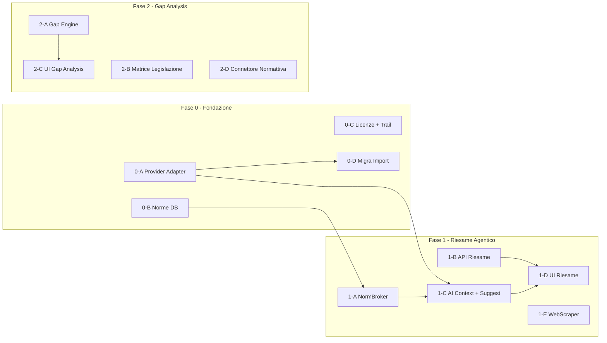

# ADR-010 — Architettura AI Agentica: NormBroker, Riesame Assistito, RAG incrementale

> **Stato**: Accettato — 12 maggio 2026
> **Autori**: Lead architect (AI), Product owner
> **Estende**: ADR-009 (AI-readiness), Sprint 9 (import PDF), Sprint 11 (riesame contratto)
> **Vincolante**: ogni nuova feature AI deve rispettare questo modello (adapter multi-provider, NormBroker, audit trail, licenze modulari).

---

## Contesto e motivazione

### Obiettivo strategico

Trasformare l'app SGQ da gestionale passivo a **piattaforma agentica** dove l'AI:
1. Assiste la **stesura del riesame requisiti** (§8.2) — sia in fase offerta che post-ordine
2. Verifica che la **documentazione del SGQ** soddisfi i requisiti di norme, leggi e decreti
3. Recupera autonomamente le norme necessarie da **fonti esterne** (siti web normativi)

### Vincoli economici

- **Fase embrionale**: nessun budget per API AI. Si usano **Gemini 1.5 Flash** (tier gratuito: 15 req/min, 1M token/giorno) e, se disponibile, **Azure OpenAI** (crediti da licenza M365 Enterprise).
- **Obiettivo**: demo funzionante per ottenere finanziamento → poi abbonamento OpenAI rivenduto agli studi come licenza.
- Ogni studio paga la licenza AI come qualsiasi altro modulo. Il proprietario della piattaforma sostiene i costi delle fonti normative e li rivende.

### Risorse disponibili

| Risorsa | Stato |
|---|---|
| Norme ISO 9001, 14001, 45001, 3834 in markdown | Già nel repo (`docs/Normative/`) |
| Credenziali siti web normativi (UNI Store, CEI, ecc.) | Disponibili al proprietario, da configurare |
| Account Copilot 365 Enterprise | Disponibile (potenziale Azure OpenAI con crediti) |
| Account Gemini Pro | Disponibile (API gratuita per Gemini Flash) |
| Pipeline import PDF (Sprint 9) | Già in produzione (`importAiExtraction.service.js`) |
| Mini-specifica riesame contratto (Sprint 11) | Documento scritto, non implementato |

---

## Decisioni architetturali

### 1. Adapter multi-provider AI

Un unico servizio backend (`aiProviderAdapter.js`) astrae il provider LLM. Il codice applicativo non sa mai quale provider sta usando.

```
aiProviderAdapter.js
  ├── GeminiAdapter      → generativelanguage.googleapis.com (default, gratis)
  ├── AzureOpenAIAdapter → {resource}.openai.azure.com (se credenziali Azure)
  ├── OpenAIAdapter      → api.openai.com (futuro, a pagamento)
  └── (futuri adapter)

Interfaccia comune:
  chat(messages[], options) → { content, model, tokens, cost }
  chatStream(messages[], onChunk) → AsyncIterator
  embedText(text) → float[] (per RAG Fase 3)
```

**Configurazione**: variabili `.env` sul VPS. Il provider attivo è determinato da quale chiave API è presente.

```env
# Gemini (default — gratis)
GEMINI_API_KEY=...
GEMINI_MODEL=gemini-1.5-flash

# Azure OpenAI (alternativa — se crediti Azure disponibili)
AZURE_OPENAI_ENDPOINT=https://{resource}.openai.azure.com
AZURE_OPENAI_API_KEY=...
AZURE_OPENAI_DEPLOYMENT=gpt-4o-mini

# OpenAI diretto (futuro — a pagamento)
OPENAI_API_KEY=...
OPENAI_MODEL=gpt-4o-mini
```

**Priorità di fallback**: `GEMINI_API_KEY` → `AZURE_OPENAI_*` → `OPENAI_API_KEY`. Se nessuna chiave è presente → feature AI non disponibili (graceful degradation).

**Retrocompatibilità Sprint 9**: `importAiExtraction.service.js` viene migrato per usare l'adapter invece di `fetch` diretto verso OpenAI. Zero breaking change: se solo `OPENAI_API_KEY` è configurata, il comportamento è identico a prima.

### 2. NormBroker — recupero norme multi-source

Servizio backend (`normBroker.service.js`) che orchestra il recupero di norme da fonti eterogenee.

```
normBroker.service.js
  ├── LocalStoreConnector   → tabella norm_requirements (cache locale, <100ms)
  ├── ApiConnector          → Standards Digital HAPI, ISO Open Data (1-3s)
  ├── WebScraperConnector   → UNI Store, CEI, BSI via Playwright (5-15s)
  ├── PublicLawConnector    → Normattiva.it, EUR-Lex (2-5s, gratuito)
  └── ManualUploadFallback  → l'utente carica il PDF della norma

Interfaccia comune per ogni connettore:
  searchByCode(code) → { found, title, source, accessType }
  getClauseText(code, clauseRef) → { text, title, fullRef }
  getFullNorm(code) → { clauses: [{ ref, title, text }] }
```

**Flusso di risoluzione** (cascata):

```
Serve norma "EN ISO 17635"
  1. Cerca in LocalStore (norm_requirements) → trovata? → usa (istantaneo)
  2. Cerca via API (se configurata) → trovata? → scarica, indicizza in locale, usa
  3. Cerca via WebScraper (se credenziali configurate) → trovata? → scarica, indicizza, usa
  4. Cerca su fonti pubbliche → trovata? → scarica, indicizza, usa
  5. Non trovata → segnala all'utente "norma non disponibile, caricare manualmente"
```

**Caching aggressivo**: ogni norma recuperata viene salvata in `norm_requirements`. Le richieste successive sono istantanee. Job periodico (settimanale) verifica aggiornamenti.

**Multi-tenant**: le norme sono condivise (contenuto universale). L'accesso è tracciato per `organization_id` in `norm_access_log` per fatturazione.

**Configurazione fonti**: tabella `norm_sources` con credenziali cifrate per connettore. Il proprietario (superadmin) configura le fonti. Gli studi ereditano l'accesso in base alla licenza.

### 3. Base di conoscenza normativa strutturata

Le norme vanno strutturate **per clausola**, non come testo piatto. Nuova tabella:

```sql
CREATE TABLE norm_requirements (
  id              INT IDENTITY PRIMARY KEY,
  standard_code   NVARCHAR(50)  NOT NULL,    -- 'ISO_9001_2015', 'DLgs_81_2008'
  clause_ref      NVARCHAR(30)  NOT NULL,    -- '8.4.2.b', 'art.111'
  clause_title    NVARCHAR(500),
  requirement_text NVARCHAR(MAX) NOT NULL,
  applicability   NVARCHAR(200),             -- 'sempre', 'se saldature', 'se ambiente'
  linked_legislation NVARCHAR(500),          -- 'D.Lgs. 81/2008 art. 111' (cross-ref)
  source          NVARCHAR(50)  NOT NULL,    -- 'local_file', 'uni_store', 'normattiva'
  source_url      NVARCHAR(500),
  last_synced_at  DATETIME2     NOT NULL DEFAULT GETDATE(),
  norm_version    NVARCHAR(20),
  is_current      BIT           NOT NULL DEFAULT 1,
  CONSTRAINT UQ_norm_req UNIQUE (standard_code, clause_ref, norm_version)
);
CREATE INDEX IX_norm_req_code ON norm_requirements(standard_code);
CREATE INDEX IX_norm_req_clause ON norm_requirements(clause_ref);
```

**Import iniziale**: le 6 norme in `docs/Normative/*.md` vengono parsate e caricate in questa tabella (job one-time). Struttura per pagina → strutturata per clausola via LLM (Gemini).

### 4. Riesame requisiti agentico (§8.2)

Estende la mini-specifica Sprint 11 con capacità AI. Il workflow degli stati resta invariato (DRAFT → INTAKE_REVIEW → ... → APPROVED). L'AI interviene specificamente in due momenti:

**Momento A — Ingestione capitolato (stato DRAFT → INTAKE_REVIEW)**:
1. Utente carica il capitolato del committente (PDF)
2. AI estrae: requisiti tecnici, norme citate, requisiti documentali, scadenze
3. Per ogni norma citata: NormBroker la recupera e la rende disponibile
4. AI cross-referenzia con documenti azienda (da `document_registry`)
5. AI pre-compila la checklist riesame preliminare con gap identificati

**Momento B — Riesame definitivo post-ordine (stato ORDER_RECEIVED → FINAL_REVIEW)**:
1. AI confronta ordine vs offerta vs capacità aggiornata dell'azienda
2. Identifica discrepanze: "L'ordine richiede X ma l'offerta prevedeva Y"
3. Verifica scadenze: "Certificato saldatore Z scade durante la commessa"

**Output AI**: sempre suggerimenti con riferimento normativo preciso. L'utente accetta, modifica o rifiuta ogni suggerimento. Tracciabilità completa (ISO 9001 §7.5).

### 5. Gap analysis documentazione vs norme/leggi

Secondo caso d'uso core. L'AI verifica clausola per clausola che la documentazione dell'azienda copra i requisiti normativi.

**Input**: documenti azienda dal `document_registry` + norme applicabili da `norm_requirements`
**Output**: matrice di copertura con gap e azioni suggerite

```
Per ogni clausola della norma:
  1. RAG cerca nei documenti azienda dove il requisito è trattato
  2. AI valuta la copertura: coperto / parziale / mancante
  3. Se mancante: suggerisce azione (es. "redigere procedura per §8.4")
  4. Se parziale: indica cosa manca (es. "PG-07 non copre §8.4.2.b")
```

### 6. RAG incrementale (3 fasi)

Il RAG non è un modulo monolitico. Cresce con la piattaforma:

| Fase | Strategia | Tecnologia | Quando |
|---|---|---|---|
| **Fase 1** | Context lungo | Gemini 1.5 Flash (1M token window): norma + capitolato + documenti azienda caricati integralmente nel prompt | Subito (costo zero) |
| **Fase 2** | Chunking + ricerca keyword | `norm_requirements` con ricerca SQL full-text su `requirement_text`. Il NormBroker seleziona solo le clausole pertinenti | Dopo import norme strutturate |
| **Fase 3** | Vector store + embedding | pgvector su PostgreSQL: embedding di documenti azienda, storico audit/NC. Ricerca semantica cross-documento | Dopo finanziamento (richiede OpenAI embeddings o alternative) |

**Principio**: ogni fase **include** la precedente. Il context lungo di Gemini resta disponibile anche quando il vector store è attivo (utile per documenti specifici non ancora indicizzati).

### 7. Licenze AI e modello commerciale

| Chiave licenza | Cosa include | Chi paga |
|---|---|---|
| `ai_import` (esistente) | Import PDF con estrazione strutturata | Studio |
| `ai_assist` (nuova) | Suggerimenti in compilazione audit, conclusioni, NC | Studio |
| `ai_norms` (nuova) | Accesso on-demand a norme via NormBroker + gap analysis | Studio |
| `ai_review` (nuova) | Riesame requisiti assistito (§8.2) — il killer feature | Studio |
| `ai_chat` (futura Fase 3) | Assistente conversazionale con RAG | Studio |

**Comportamento "B"** (da ADR-009): feature AI completamente nascoste se licenza non attiva.

**Proprietario della piattaforma**: sostiene i costi delle fonti normative (abbonamenti UNI Store, ecc.) e delle API AI. Li rivende aggregati nelle licenze studio.

### 8. Audit trail AI (ISO 9001 §7.5)

Ogni interazione AI è tracciata:

```sql
CREATE TABLE ai_interactions (
  id              INT IDENTITY PRIMARY KEY,
  organization_id INT           NOT NULL,
  user_id         INT           NOT NULL,
  feature         NVARCHAR(30)  NOT NULL,  -- 'import', 'review', 'gap_analysis', 'assist', 'chat'
  provider        NVARCHAR(20)  NOT NULL,  -- 'gemini', 'azure_openai', 'openai'
  model           NVARCHAR(50)  NOT NULL,
  input_tokens    INT,
  output_tokens   INT,
  cost_usd        DECIMAL(10,6),
  latency_ms      INT,
  status          NVARCHAR(20)  NOT NULL,  -- 'success', 'error', 'timeout', 'rejected_by_user'
  context_summary NVARCHAR(500),           -- breve descrizione del contesto (non il prompt intero)
  created_at      DATETIME2     NOT NULL DEFAULT GETDATE(),
  INDEX IX_ai_org_date (organization_id, created_at)
);
```

### 9. Privacy e data residency

| Provider | Dove vanno i dati | Note |
|---|---|---|
| Gemini | Server Google (US/EU) | Il tier gratuito non offre garanzie di residency EU |
| Azure OpenAI | Datacenter Azure scelto dal tenant | Con setup EU, i dati restano in Europa |
| OpenAI | Server OpenAI (US) | API standard, no garanzia EU |

**Regola**: l'AI produce **analisi derivate**, non copia integrale delle norme. Il testo normativo è usato come contesto per generare suggerimenti, non riprodotto all'utente. Questo rispetta il copyright UNI/ISO.

**Disclaimer UI**: "Le analisi AI sono suggerimenti basati sui documenti disponibili. Ogni decisione deve essere validata dal professionista responsabile."

---

## Verifica scalabilità e robustezza

### Test di scalabilità

| Scenario | Funziona? | Perché |
|---|---|---|
| Aggiungere un nuovo provider AI (es. Claude) | 1 file adapter + 1 variabile .env | Adapter pattern |
| Aggiungere una nuova fonte normativa (es. DIN) | 1 file connector + 1 riga in `norm_sources` | NormBroker pattern |
| 50 studi che chiedono la stessa norma contemporaneamente | 1 sola richiesta al sito, poi cache | LocalStore con caching |
| Studio chiede norma in lingua diversa (tedesco, inglese) | Connector dedicato per fonte, campo `language` in `norm_requirements` | Estensibile |
| 1000 clausole in `norm_requirements` per una singola norma | Query SQL indicizzata su `standard_code` + `clause_ref` | SQL Server gestisce senza problemi |
| Gemini down | Fallback su Azure OpenAI (se configurato), altrimenti graceful degradation | Cascata provider |
| Sito UNI Store cambia struttura HTML | Solo il WebScraper per UNI va aggiornato, tutto il resto continua | Isolamento connettore |
| Utente offline | "AI non disponibile offline" — compilazione manuale continua normalmente | Già pattern dell'app |

### Rischi e mitigazioni

| Rischio | Probabilità | Impatto | Mitigazione |
|---|---|---|---|
| Web scraping fragile (siti cambiano HTML) | Alta | Medio | Caching aggressivo, fallback a upload manuale, monitor errori |
| AI allucina riferimenti normativi | Media | Alto | Ogni suggerimento ha link al testo sorgente verificabile. Human-in-the-loop obbligatorio |
| Gemini tier gratuito insufficiente per molti studi | Media | Medio | Rate limit per org, token tracking, upgrade ad Azure/OpenAI al bisogno |
| Qualità testo norme da web scraping | Media | Medio | Confidence score, revisione umana opzionale, confronto con PDF originale |
| Blocco IP da siti normativi per troppi accessi | Bassa | Alto | Rate limit rispettoso, caching 7+ giorni, User-Agent corretto |
| GDPR: dati azienda inviati a provider AI US | Media | Alto | Opzione Azure OpenAI EU per clienti sensibili, disclaimer UI |

---

## Piano di implementazione — Task paralleli per Cursor multitask

### Struttura multi-agente

Ogni fase è suddivisa in task indipendenti eseguibili in parallelo da agenti Cursor separati. I task condividono il branch ma lavorano su file diversi (nessun conflitto Git).

### FASE 0 — Fondazione AI

```
TASK 0-A: Adapter multi-provider AI (backend)
  Branch: cursor/ai-provider-adapter
  File: backend/src/services/aiProviderAdapter.js
        backend/src/services/adapters/geminiAdapter.js
        backend/src/services/adapters/azureOpenaiAdapter.js
        backend/src/services/adapters/openaiAdapter.js
  Test: backend/src/services/aiProviderAdapter.test.js
  DoD: Gemini Flash funzionante con API key di test

TASK 0-B: DB norme strutturate + import iniziale (backend/DB)
  Branch: cursor/norm-requirements-db
  File: backend/database/migrations/052_norm_requirements.sql
        backend/scripts/import-norms-from-markdown.js
  DoD: 6 norme da docs/Normative/ parsate e caricate in norm_requirements

TASK 0-C: Licenze AI + audit trail (backend)
  Branch: cursor/ai-licenses-audit-trail
  File: backend/src/services/moduleLicense.service.js (aggiunta chiavi)
        backend/database/migrations/053_ai_interactions.sql
        backend/src/middleware/aiAuditTrail.middleware.js
  DoD: ai_assist, ai_norms, ai_review in KNOWN_MODULE_KEYS; middleware logging

TASK 0-D: Migrazione importAiExtraction su adapter (backend)
  Branch: cursor/migrate-import-to-adapter
  File: backend/src/services/importAiExtraction.service.js (refactor)
  DoD: Sprint 9 import PDF funziona identicamente via adapter
  Prerequisito: TASK 0-A completato
```

**Parallelismo**: 0-A, 0-B, 0-C eseguibili in parallelo. 0-D dopo 0-A.

### FASE 1 — Riesame requisiti agentico + RAG light

```
TASK 1-A: NormBroker service + LocalStore connector (backend)
  File: backend/src/services/normBroker.service.js
        backend/src/services/normConnectors/localStoreConnector.js
        backend/src/services/normConnectors/publicLawConnector.js
  DoD: ricerca clausole per codice norma funzionante su norm_requirements locale

TASK 1-B: API riesame requisiti — endpoint + controller (backend)
  File: backend/src/controllers/contractReview.controller.js
        backend/src/routes/contractReview.routes.js
        backend/database/migrations/054_commercial_cases.sql
  DoD: CRUD commercial_cases + cambio stato + checklist riesame
  Prerequisito: segue Sprint 11 mini-specifica già scritta

TASK 1-C: AI context builder + endpoint /ai/suggest (backend)
  File: backend/src/services/aiContextBuilder.service.js
        backend/src/controllers/aiAssist.controller.js
        backend/src/routes/aiAssist.routes.js
  DoD: POST /ai/suggest con feature='review_requirements' funzionante
  Prerequisito: TASK 0-A, TASK 1-A

TASK 1-D: UI riesame requisiti (frontend)
  File: app/src/pages/ContractReviewPage.jsx
        app/src/components/ContractReviewChecklist.jsx
        app/src/components/AiSuggestionInline.jsx
        app/src/hooks/useAiAssist.js
  DoD: pagina riesame con checklist pre-compilata da AI, pulsanti accetta/rifiuta
  Prerequisito: TASK 1-B, TASK 1-C

TASK 1-E: WebScraper connector per fonti normative (backend)
  File: backend/src/services/normConnectors/webScraperConnector.js
        backend/src/services/normConnectors/uniStoreConnector.js (specifico)
  DoD: login automatico + ricerca norma + estrazione testo da UNI Store
  Note: richiede credenziali dal proprietario; sviluppabile in parallelo con mock
```

**Parallelismo**: 1-A, 1-B, 1-E eseguibili in parallelo. 1-C dopo 0-A+1-A. 1-D dopo 1-B+1-C.

### FASE 2 — Gap analysis + legislazione

```
TASK 2-A: Gap analysis engine (backend)
  File: backend/src/services/gapAnalysis.service.js
        backend/src/controllers/gapAnalysis.controller.js
  DoD: dato un company_id e uno standard_code, produce matrice copertura

TASK 2-B: Matrice norme ↔ legislazione (backend/DB)
  File: backend/database/migrations/055_norm_legislation_matrix.sql
        backend/scripts/seed-legislation-cross-refs.js
  DoD: cross-ref ISO 9001↔D.Lgs., ISO 14001↔D.Lgs. 152, ISO 45001↔D.Lgs. 81

TASK 2-C: UI gap analysis + dashboard conformità (frontend)
  File: app/src/pages/GapAnalysisPage.jsx
        app/src/components/ComplianceMatrix.jsx
        app/src/components/ComplianceDashboard.jsx
  DoD: matrice visuale con semaforo verde/giallo/rosso per clausola

TASK 2-D: Connettore Normattiva.it (backend)
  File: backend/src/services/normConnectors/normativaConnector.js
  DoD: ricerca per numero legge/decreto, estrazione articoli pertinenti
```

**Parallelismo**: 2-A, 2-B, 2-D tutti in parallelo. 2-C dopo 2-A.

### FASE 3 — RAG completo + chat (dopo finanziamento)

```
TASK 3-A: Vector store setup (pgvector o alternativa)
TASK 3-B: Pipeline indicizzazione documenti
TASK 3-C: Endpoint POST /ai/chat con streaming + function calling
TASK 3-D: UI AiChatPanel + AiChatFab
TASK 3-E: Apprendimento per azienda (feedback loop)
```

Dettaglio delle sotto-task Fase 3 da definire dopo completamento Fase 1 e ottenimento finanziamento.

---

## Mappa dipendenze



---

## Riferimenti

- [ADR-009](ADR-009-multi-standard-architettura-per-norma.md) — AI-readiness checklist, licenze, pattern componenti
- [MINI_SPEC_RIESAME_REQUISITI_CONTRATTO.md](../MINI_SPEC_RIESAME_REQUISITI_CONTRATTO.md) — workflow stati riesame
- [PROJECT_ROADMAP.md](../PROJECT_ROADMAP.md) — Sprint 9 (import), Sprint 11 (riesame), Vision vincolante
- [GUIDA_CONSOLIDATA.md](../GUIDA_CONSOLIDATA.md) — strategia multi-agenti
- ISO Open Data: https://www.iso.org/open-data.html — metadata norme gratuiti
- Standards Digital HAPI: https://www.standardsdigital.com/import — API unificata norme
- Normattiva.it: https://www.normattiva.it — legislazione italiana gratuita
